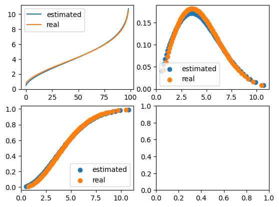
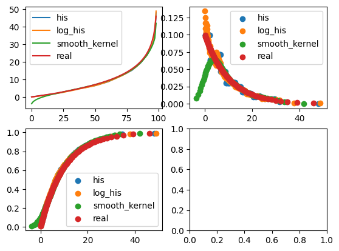
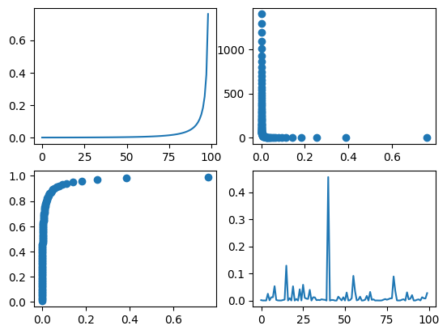

# 连续分布
## continuous probability distribution


```python
from data_utils.stochastic_utils.distributions.basic_distributions import *
from data_utils.stochastic_utils.distributions.estimation import *
import numpy
from matplotlib import pyplot
```

# 初始化威布尔分布(形状参数, 尺度参数)
## Initialize Weibull distribution (shape parameters, scale parameters)


```python
w = WeibullDistribution(2,5)
```

```python
# 绘制ppf, pdf, cdf
fig, axs = pyplot.subplots(2, 2)
axs[0][0].plot(w.ppf().y)
axs[0][1].scatter(x=w.pdf().x, y=w.pdf().y)
axs[1][0].scatter(x=w.pdf().x, y=w.pdf().y)
axs[1][1].plot(w.rvf(100))
pyplot.show()
```


    

    


# 使用随机变量进行参数拟合
## Using random variables for parameter fitting

```python
es = SangDistEstimated(w.rvf(1000), loss=0.01)
esd, loss, _ = es.data_estimate(WeibullDistribution, epoch=1000, max_try=20, timer=True)
print(loss)
fig, axs = pyplot.subplots(2, 2)
axs[0, 0].plot(w.ppf().y)
axs[0, 0].plot(esd.ppf().y)
axs[0, 0].legend(["estimated", "real"])
axs[0, 1].scatter(x=w.pdf().x, y=w.pdf().y)
axs[0, 1].scatter(x=esd.pdf().x, y=esd.pdf().y)
axs[0, 1].legend(["estimated", "real"])
axs[1, 0].scatter(x=w.pdf().x, y=w.pdf().y)
axs[1, 0].scatter(x=esd.pdf().x, y=esd.pdf().y)
axs[1, 0].legend(["estimated", "real"])
pyplot.show()
```

    data_estimate took 0.6651401519775391 seconds to execute
    0.00897614192760612
    


    

    


# 对随机变量使用非参分布拟合
## Fit random variables using non parametric distributions

```python
dist = WeibullDistribution(1, 10)
r = dist.rvf(1000)
his_dist = HistogramDist(r)
log_his_dist = LogHisDist(r)
smooth_his_dist = SmoothHisDist(r)
fig, axs = pyplot.subplots(2, 2)
axs[0, 0].plot(his_dist.ppf().y)
axs[0, 0].plot(log_his_dist.ppf().y)
axs[0, 0].plot(smooth_his_dist.ppf().y)
axs[0, 0].plot(dist.ppf().y)
axs[0, 0].legend(["his", "log_his", "smooth_kernel", "real"])
axs[0, 1].scatter(x=his_dist.pdf().x, y=his_dist.pdf().y)
axs[0, 1].scatter(x=log_his_dist.pdf().x, y=log_his_dist.pdf().y)
axs[0, 1].scatter(x=smooth_his_dist.pdf().x, y=smooth_his_dist.pdf().y)
axs[0, 1].scatter(x=dist.pdf().x, y=dist.pdf().y)
axs[0, 1].legend(["his", "log_his", "smooth_kernel", "real"])
axs[1, 0].scatter(x=his_dist.pdf().x, y=his_dist.pdf().y)
axs[1, 0].scatter(x=log_his_dist.pdf().x, y=log_his_dist.pdf().y)
axs[1, 0].scatter(x=smooth_his_dist.pdf().x, y=smooth_his_dist.pdf().y)
axs[1, 0].scatter(x=dist.pdf().x, y=dist.pdf().y)
axs[1, 0].legend(["his", "log_his", "smooth_kernel", "real"])
pyplot.show()
```


    

    


# 给定分布的均值和标准层, 拟合分布参数
## Given the mean and standard layer of the distribution, fit the distribution parameters

```python
lnd, moments, _ = moment_ed({"mean": 0, "std": 1}, LogNormalDistribution, timer=True, epoch=1000)
print(lnd)
print(moments)
fig, axs = pyplot.subplots(2, 2)
axs[0][0].plot(lnd.ppf().y)
axs[0][1].scatter(x=lnd.pdf().x, y=lnd.pdf().y)
axs[1][0].scatter(x=lnd.pdf().x, y=lnd.pdf().y)
axs[1][1].plot(lnd.rvf(100))
pyplot.show()
```

    moment_ed took 0.07788515090942383 seconds to execute
    {'name': "<class 'data_utils.stochastic_utils.distributions.basic_distributions.LogNormalDistribution'>", 'args': '()', 'kwargs': "{'mu': -6.02526544409226, 'sigma': 2.47225169091743}"}
    [0.05134173897012902, 1.089429019896013]
    


    

    


```python

```
