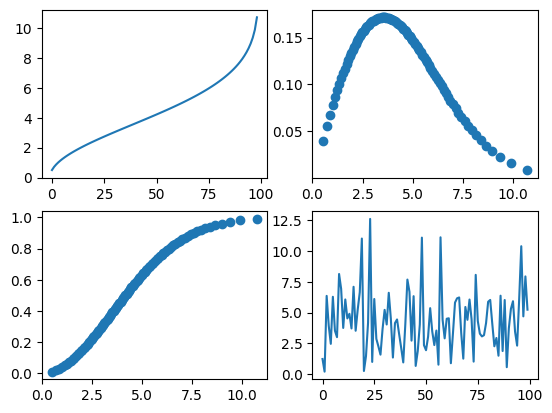

```python
from data_utils.stochastic_utils.distributions.basic_distributions import *
from data_utils.stochastic_utils.distributions.estimation import *
import numpy
from matplotlib import pyplot
```


```python
w = WeibullDistribution(2,5)
```


```python
fig, axs = pyplot.subplots(2,2)
axs[0][0].plot(w.ppf().y)
axs[0][1].scatter(x = w.pdf().x, y = w.pdf().y)
axs[1][0].scatter(x = w.cdf().x, y = w.cdf().y)
axs[1][1].plot(w.rvf(100))
pyplot.show()
```


    

    


```python
es = SangDistEstimated(w.rvf(1000), std_num=0.1)
esd, loss = es.forced_estimate(WeibullDistribution, epoch=1000, max_try=20, timer=True)
print(loss)
fig, axs = pyplot.subplots(2,2)
axs[0,0].plot(w.ppf().y)
axs[0,0].plot(esd.ppf().y)
axs[0,0].legend(["estimated", "real"])
axs[0,1].scatter(x = w.pdf().x, y = w.pdf().y)
axs[0,1].scatter(x = esd.pdf().x, y =esd.pdf().y)
axs[0,1].legend(["estimated", "real"])
axs[1,0].scatter(x = w.cdf().x, y = w.cdf().y)
axs[1,0].scatter(x = esd.cdf().x, y =esd.cdf().y)
axs[1,0].legend(["estimated", "real"])
pyplot.show()
```

    forced_estimate took 0.6447412967681885 seconds to execute
    0.01711002895112295
    


    

    


```python
dist = WeibullDistribution(1, 10)
r = dist.rvf(1000)
his_dist = HistogramDist(r)
log_his_dist = LogHisDist(r)
smooth_his_dist = SmoothHisDist(r)
fig, axs = pyplot.subplots(2,2)
axs[0,0].plot(his_dist.ppf().y)
axs[0,0].plot(log_his_dist.ppf().y)
axs[0,0].plot(smooth_his_dist.ppf().y)
axs[0,0].plot(dist.ppf().y)
axs[0,0].legend(["his", "log_his", "smooth_kernel", "real"])
axs[0,1].scatter(x = his_dist.pdf().x, y =his_dist.pdf().y)
axs[0,1].scatter(x = log_his_dist.pdf().x, y =log_his_dist.pdf().y)
axs[0,1].scatter(x = smooth_his_dist.pdf().x, y =smooth_his_dist.pdf().y)
axs[0,1].scatter(x = dist.pdf().x, y = dist.pdf().y)
axs[0,1].legend(["his", "log_his", "smooth_kernel",  "real"])
axs[1,0].scatter(x = his_dist.cdf().x, y =his_dist.cdf().y)
axs[1,0].scatter(x = log_his_dist.cdf().x, y =log_his_dist.cdf().y)
axs[1,0].scatter(x = smooth_his_dist.cdf().x, y =smooth_his_dist.cdf().y)
axs[1,0].scatter(x = dist.cdf().x, y = dist.cdf().y)
axs[1,0].legend(["his", "log_his", "smooth_kernel",  "real"])
pyplot.show()
```


    

    


```python

```
